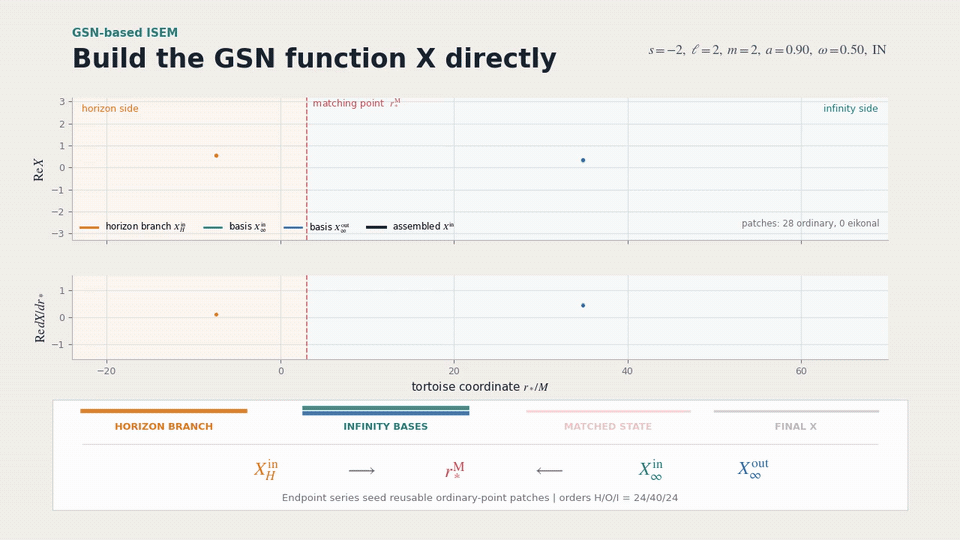

# GeneralizedSasakiNakamura.jl


[](https://github.com/ricokaloklo/GeneralizedSasakiNakamura.jl/releases)
[](http://ricokaloklo.github.io/GeneralizedSasakiNakamura.jl)

GeneralizedSasakiNakamura.jl computes solutions to the frequency-domain radial Teukolsky equation with the Generalized Sasaki-Nakamura (GSN) formalism.

The code is capable of handling *both ingoing and outgoing* radiation of scalar, electromagnetic, and gravitational type (corresponding to spin weight of $s = 0, \pm 1, \pm 2$ respectively).

The angular Teukolsky equation is solved with an accompanying julia package [SpinWeightedSpheroidalHarmonics.jl](https://github.com/ricokaloklo/SpinWeightedSpheroidalHarmonics.jl) using a spectral decomposition method.

Both codes are capable of handling *complex* frequencies, and we use $M = 1$ convention throughout.

The paper describing both the GSN formalism and the implementation can be found in [2306.16469](https://arxiv.org/abs/2306.16469). A set of Mathematica notebooks deriving all the equations used in the code can be found in [10.5281/zenodo.8080241](https://zenodo.org/records/8080242).

Starting from v0.8.0, the code is also capable of computing the gravitational waveform amplitude and fluxes at infinity and at the horizon due a test particle orbiting around a Kerr black hole in a _generic (eccentric, inclined) timelike bound orbit_ by solving the inhomogeneous SN equation using integration by parts.

Starting from v0.9.0, the package includes the direct GSN-based ISEM solver, short for _iterative series expansion matching_. The default `method = "auto"` tries `GSN-ISEM` first and falls back to the legacy automatic radial route only if direct construction fails. The explicit `method = "GSN-ISEM"` form is strict and never falls back. This path accelerates homogeneous radial functions, single-mode point-particle amplitudes, and total-flux mode summations. The release also adds a high-level total-flux interface, `Teukolsky_pointparticle_flux`, which automatically selects the circular, eccentric, inclined, or generic mode-summation strategy.

For high-index tail modes in eccentric and generic flux summations, the ISEM solver can use adaptive Levin quadrature instead of globally densifying a trapezoidal grid. The radial phase interval is refined only where the oscillatory integral has not stabilized. In generic two-dimensional convolutions, this radial adaptive Levin rule is combined with a fixed Clenshaw-Curtis rule in the polar direction, which resolves the smooth polar dependence with a compact cosine-spaced grid while keeping the expensive adaptivity in the radial direction.

## Installation
To install the package using the Julia package manager, simply type the following in the Julia REPL:
```julia
using Pkg
Pkg.add("GeneralizedSasakiNakamura")
```

*Note: There is no need to install [SpinWeightedSpheroidalHarmonics.jl](https://github.com/ricokaloklo/SpinWeightedSpheroidalHarmonics.jl) separately as it should be automatically installed by the package manager.*

The `GSN-ISEM` development branch is paired with the `Fast-eigenvalue` angular-solver branch. Install both branches explicitly (this also works on Julia 1.10):
```julia
using Pkg
Pkg.add(url="https://github.com/CuberYyc808/SpinWeightedSpheroidalHarmonics.jl.git", rev="Fast-eigenvalue")
Pkg.add(url="https://github.com/CuberYyc808/GeneralizedSasakiNakamura.jl.git", rev="GSN-ISEM")
```

## Highlights
### Two classes of solvers
The package supports two complementary classes of solvers:

- **Numerical solver**: direct numerical integration of the radial equation using the `linear` or `Riccati` methods, patched with analytical solutions near the boundaries.
- **Semi-analytical solver**: matching series expansions iteratively, by specifying strict `method = "GSN-ISEM"` or by using it as the first route selected by `method = "auto"`.

### Numerical solver: linear/Riccati integration
The original GSN solver works at *both low and high frequencies* by numerically evolving the radial equation and attaching analytical boundary ansatzes near the horizon and infinity:

<p align="center">
  
</p>

The on-the-fly benchmark against the Mathematica MST implementation is shown below:

<table>
  <tr>
    <th>GeneralizedSasakiNakamura.jl numerical solver</th>
    <th><a href="https://github.com/BlackHolePerturbationToolkit/Teukolsky">Teukolsky</a> Mathematica package using the MST method </th>
  </tr>
  <tr>
    <td><p align="center"></p></td>
    <td><p align="center"></p></td>
  </tr>
</table>

*(There was no caching in this benchmark; the equation was solved on the fly. The notebook generating the speed animation can be found [here](https://github.com/ricokaloklo/GeneralizedSasakiNakamura.jl/blob/main/examples/realtime-demo.ipynb).)*

### Semi-analytical solver: direct GSN-based ISEM
The semi-analytical `GSN-ISEM` solver constructs the GSN radial function $X$ directly from matched series expansions; the Teukolsky function $R$ and the source-adapted function $Y$ are numerical transformations of the same route:

<p align="center">
  
</p>

Users can choose this solver strictly by specifying `method = "GSN-ISEM"`. The default `method = "auto"` first tries the same solver with automatic frequency, spin, representation, and matching controls; if direct construction throws, it reports the failure and falls back to the legacy automatic radial route. The previous `method = "ISEM"` implementation and the legacy `linear` and `Riccati` solvers remain available explicitly.

The homogeneous radial Teukolsky/GSN equations are solved typically at millisecond timescale or faster.

The `GSN-ISEM` radial path is also used in the accelerated single-mode point-particle amplitudes and total-flux mode summations.

Superradiance-threshold solutions with $\omega = m a / (2 r_+)$ are handled by a dedicated horizon-threshold GSN-ISEM branch, while static/zero-frequency solutions are solved analytically with Gauss hypergeometric functions.

### Easy to use
The following code snippet lets you solve the (source-free) Teukolsky function (in frequency domain) for the mode $s=-2, \ell=2, m=2, a/M=0.7, M\omega=0.5$ that satisfies the purely-ingoing boundary condition at the horizon, $R^{\textrm{in}}$, and the purely-outgoing boundary condition at spatial infinity, $R^{\textrm{up}}$, respectively:
```julia
using GeneralizedSasakiNakamura # This is going to take some time to pre-compile, mostly due to DifferentialEquations.jl

# Specify which mode to solve
s=-2; l=2; m=2; a=0.7; omega=0.5;

# NOTE: julia uses 'just-ahead-of-time' compilation. Calling this the first time in each session will take some time
Rin, Rup = Teukolsky_radial(s, l, m, a, omega)
```
That's it! If you run this on Julia REPL, it should give you something like this
```
(
TeukolskyRadialFunction(
    mode = Mode(s = -2, l = 2, m = 2, a = 0.7, omega = 0.5, lambda = 1.6966094016353415),
    boundary_condition = IN,
    transmission_amplitude = 1.0 + 0.0im,
    incidence_amplitude = 6.5365876610342255 - 4.941203896939344im,
    reflection_amplitude = -0.12824661911999655 - 0.44048133495464536im,
    normalization_convention = UNIT_TEUKOLSKY_TRANS
),
TeukolskyRadialFunction(
    mode = Mode(s = -2, l = 2, m = 2, a = 0.7, omega = 0.5, lambda = 1.6966094016353415),
    boundary_condition = UP,
    transmission_amplitude = 1.0 + 0.0im,
    incidence_amplitude = -1.169884033354234 - 2.545572333993im,
    reflection_amplitude = 2.5169908585182306 - 8.644964686136989im,
    normalization_convention = UNIT_TEUKOLSKY_TRANS
))
```
In Julia REPL, you can check out all the asymptotic amplitudes at a glimpse using something like
```julia
julia> Rin
TeukolskyRadialFunction(
    mode = Mode(s = -2, l = 2, m = 2, a = 0.7, omega = 0.5, lambda = 1.6966094016353415),
    boundary_condition = IN,
    transmission_amplitude = 1.0 + 0.0im,
    incidence_amplitude = 6.5365876610342255 - 4.941203896939344im,
    reflection_amplitude = -0.12824661911999655 - 0.44048133495464536im,
    normalization_convention = UNIT_TEUKOLSKY_TRANS
)
```

For example, if we want to evaluate the Teukolsky function $R^{\textrm{in}}$ at the location $r = 10M$, simply do
```julia
Rin(10)
```
This should give
```
77.5750841719755 - 429.40290951043795im
```

#### Complex frequencies, quasinormal modes, and excitation factors

`Teukolsky_radial`, `GSN_radial`, and `Y_radial` accept complex frequencies.
The QNM interface first computes the complex frequency and then evaluates the
corresponding GSN scattering data. For the $a=0.68$, $s=-2$,
$(\ell,m,n)=(2,2,0)$ mode, the ordinary and mirror branches are

```julia
ordinary_mode = qnm(0.68, -2, 2, 2, 0)
mirror_mode = qnm(0.68, -2, 2, 2, 0, mirror)
```

These calls produce

```text
QuasiNormalMode(
    parameters = (a = 0.68, s = -2, l = 2, m = 2, n = 0)
    omega = 0.52397510429008387 - 0.08151262363119878im
    lambda = 1.6550030612535804 + 0.36026776076185824im
    incidence_amplitude = -3.0391746564809884e-13 - 2.983073027166103e-13im
    reflection_amplitude = -0.80073261705161114 + 0.029136276806100096im
    incidence_derivative = -2.1438079318803891 + 6.7875557750678599im
    excitation_factor = 0.019833940774776078 + 0.10427056861193215im
    formalism = GSN)

QuasiNormalMode(
    parameters = (a = 0.68, s = -2, l = 2, m = 2, n = 0)
    omega = -0.31116285768546104 - 0.088754663319966773im
    lambda = 5.4219094861401089 + 0.40958044727149007im
    incidence_amplitude = -5.8582952128444212e-12 - 4.3983649731701936e-12im
    reflection_amplitude = -1.2675830722584693 + 0.5743491661385175im
    incidence_derivative = 1496.3346662535052 - 2345.3624239939027im
    excitation_factor = 0.00073852800656908318 + 0.00022814176420702393im
    formalism = GSN)
```

The computed frequency can be passed directly to the radial interfaces without
truncating its digits:

```julia
Rin, Rup = Teukolsky_radial(-2, 2, 2, 0.68, ordinary_mode.omega)
```

```julia
julia> Rup
TeukolskyRadialFunction(
    mode = Mode(s = -2, l = 2, m = 2, a = 0.68, omega = 0.5239751042900839 - 0.08151262363119878im, lambda = 1.6550030612535804 + 0.36026776076185824im),
    boundary_condition = UP,
    transmission_amplitude = 1.0 + 0.0im,
    incidence_amplitude = 1.3263819289687083e-13 - 9.497421461186817e-13im,
    reflection_amplitude = 1.1011615657248295 + 2.130059992157767im,
    normalization_convention = UNIT_TEUKOLSKY_TRANS
)
```

For a QNM frequency $\omega_q$, the returned GSN excitation factor is

```math
\alpha^{{\rm GSN}}_{\ell m\omega_q}
=\left.\frac{\partial A^{{\rm GSN},{\rm inc}}_{\ell m\omega}}
{\partial\omega}\right|_{\omega=\omega_q},
\qquad
B^{{\rm GSN}}_{\ell m\omega_q}
=\frac{A^{{\rm GSN},{\rm ref}}_{\ell m\omega_q}}
{2\omega_q\alpha^{{\rm GSN}}_{\ell m\omega_q}}.
```

`ordinary` is the default branch. `mirror` computes the negative-real branch
directly rather than filling its amplitudes by conjugation. Use `detailed=true`
only when callable `X`, `Y`, and `R` solutions are needed. See the
[QNM documentation](docs/src/QNM.md) for root-only and sequence interfaces.

#### Solving the inhomogeneous radial Teukolsky/SN equation with a point-particle source on a generic timelike bound orbit
This can now be done easily with this code.
Suppose we want to compute the inhomogeneous solution to the radial Teukolsky equation at infinity for the $s = -2$, $\ell = m = 2$ mode driven by a test particle on a bound geodesic with $a/M = 0.9, p = 6M, e = 0.7, x = \cos(\pi/4)$, one can simply do
```julia
mode_info = Teukolsky_pointparticle_mode(-2, 2, 2, 0, 0, 0.9, 6, 0.7, cos(π/4))
```
where $n = 0$ and $k = 0$ label the radial and polar modes, respectively.
To have a glimpse of the output, one can do so with
```julia
julia> mode_info
TeukolskyPointParticleMode(
    mode = Mode(s = -2, l = 2, m = 2, n = 0, k = 0, a = 0.9, omega = 0.06568724726732737, lambda = 3.6067890121199833),
    amplitude_inf = 0.00023429507956769735 - 6.558414441157074e-5im,
    energy_flux_inf = 1.0917330113048381e-6,
    angular_momentum_flux_inf = 3.324033375494676e-5,
    Carter_const_flux_inf = 5.890504443058042e-5,
    method = (method = "isem_trapezoidal", radial_method = "GSN-ISEM", radial_sfe = false, N = 256, K = 64, truncation_floor = 1.0e-16),
)
```
To access for example the amplitude at infinity,
```julia
julia> mode_info.amplitude
0.00023429507956769735 - 6.558414441157074e-5im
```
which is the value for $Z^{\infty}_{\ell m n k}$, the amplitude of the inhomogeneous radial Teukolsky solution near infinity for that particular frequency.

If we want to compute the inhomogeneous solution to the radial Teukolsky equation at the event horizon for the 
same set of parameters, we can simply change the sign of $s$ to $2$
```julia
mode_info = Teukolsky_pointparticle_mode(2, 2, 2, 0, 0, 0.9, 6, 0.7, cos(π/4))
```
The output should be
```julia
julia> mode_info
TeukolskyPointParticleMode(
    mode = Mode(s = 2, l = 2, m = 2, n = 0, k = 0, a = 0.9, omega = 0.06568724726732737, lambda = -0.3932109878800166),
    amplitude_hor = 0.006089946888790547 - 0.0014130019665094177im,
    energy_flux_hor = -2.8438148784299547e-9,
    angular_momentum_flux_hor = -8.658651402627612e-8,
    Carter_const_flux_hor = -1.5343956812851922e-7,
    method = (method = "isem_trapezoidal", radial_method = "GSN-ISEM", radial_sfe = false, N = 256, K = 64, truncation_floor = 1.0e-16),
)
```
To access for example the amplitude at the horizon,
```julia
julia> mode_info.amplitude
0.006089946888790547 - 0.0014130019665094177im
```
which is the value for $Z^{\mathrm{H}}_{\ell m n k}$, the amplitude of the inhomogeneous radial Teukolsky solution near the horizon for that particular frequency.

Total fluxes can be computed with the orbit-aware high-level interface. A generic-orbit total-flux run can be substantially slower than an eccentric equatorial run because it performs two-dimensional convolution integrals.
```julia
julia> flux = Teukolsky_pointparticle_flux(0.9, 6.0, 0.7, 1.0; tol=1e-8)
TeukolskyPointParticleFlux(
    orbital_parameters(a = 0.9, p = 6.0, e = 0.7, x = 1.0),
    orbit_type = eccentric,
    infinity_energy_flux = 0.0007457787885306636,
    infinity_angular_momentum_flux = 0.00675951769541119,
    infinity_carter_constant_flux = 0.0,
    horizon_energy_flux = -8.777498500233843e-6,
    horizon_angular_momentum_flux = -7.36178669754373e-5,
    horizon_carter_constant_flux = 0.0,
    total_modes = 36726,
    n_reached = (infinity = 124, horizon = 58),
    convolution_integral = (strategy = "ISEM adaptive trapezoidal for all computed n; tail ISEM adaptive Levin enabled but not triggered", tail_levin_nmin = 50, tail_levin_local_n = 16, tail_levin_max_depth = 8),
    tolerance = 1.0e-8,
    truncation_floor = (infinity = 1.0e-16, horizon = 1.0e-16),
    cost = 74.72738218307495 seconds,
)
```
This warm high-eccentricity equatorial run averaged about `2.035 ms` per computed mode.

```julia
julia> flux = Teukolsky_pointparticle_flux(0.9, 6.0, 0.7, 0.5; tol=1e-8)
TeukolskyPointParticleFlux(
    orbital_parameters(a = 0.9, p = 6.0, e = 0.7, x = 0.5),
    orbit_type = generic,
    infinity_energy_flux = 0.001146554871827448,
    infinity_angular_momentum_flux = 0.006379470773907821,
    infinity_carter_constant_flux = 0.04144388278184294,
    horizon_energy_flux = -9.201266282186275e-6,
    horizon_angular_momentum_flux = -0.00036271559365667997,
    horizon_carter_constant_flux = 0.0009653100803714303,
    total_modes = 443900,
    n_reached = (infinity = 134, horizon = 72),
    convolution_integral = (strategy = "ISEM adaptive trapezoidal for all computed n; tail ISEM adaptive Levin enabled but not triggered", tail_levin_nmin = 50, tail_levin_local_n = 16, tail_levin_max_depth = 8),
    tolerance = 1.0e-8,
    truncation_floor = (infinity = 1.0e-16, horizon = 1.0e-16),
    cost = 1627.6419110298157 seconds,
)
```
This high-eccentricity generic run averaged about `3.667 ms` per computed mode.

The function automatically dispatches to circular, eccentric, inclined, or generic mode summation according to the supplied orbital parameters.

In the high-`n` tail, eccentric and generic summations can switch from uniform-grid trapezoidal sampling to adaptive Levin quadrature. For generic two-dimensional convolutions, the default accelerated tail calculation uses adaptive Levin in the radial direction and Clenshaw-Curtis sampling in the polar direction, reducing the need for a uniformly dense two-dimensional grid.

## How to cite
If you have used this code in your research that leads to a publication, please cite the following article:
```
@article{Lo:2023fvv,
    author = "Lo, Rico K. L.",
    title = "{Recipes for computing radiation from a Kerr black hole using a generalized Sasaki-Nakamura formalism: Homogeneous solutions}",
    eprint = "2306.16469",
    archivePrefix = "arXiv",
    primaryClass = "gr-qc",
    doi = "10.1103/PhysRevD.110.124070",
    journal = "Phys. Rev. D",
    volume = "110",
    number = "12",
    pages = "124070",
    year = "2024"
}
```

Additionally, if you have used this code's capability to solve for solutions with complex frequencies, please also cite the following article:
```
@article{Lo:2025njp,
    author = "Lo, Rico K. L. and Sabani, Leart and Cardoso, Vitor",
    title = "{Quasinormal modes and excitation factors of Kerr black holes}",
    eprint = "2504.00084",
    archivePrefix = "arXiv",
    primaryClass = "gr-qc",
    doi = "10.1103/PhysRevD.111.124002",
    journal = "Phys. Rev. D",
    volume = "111",
    number = "12",
    pages = "124002",
    year = "2025"
}
```

If you have used this code's capability to solve for the gravitational waveform amplitudes and fluxes at infinity and at horizon with a test particle orbiting a Kerr black hole in a generic timelike bound and stable orbit (e.g., for extreme mass ratio inspiral waveforms), please cite the following articles:
```
@article{Yin:2025kls,
    author = "Yin, Yucheng and Lo, Rico K. L. and Chen, Xian",
    title = "{Gravitational radiation from Kerr black holes using the Sasaki-Nakamura formalism: waveforms and fluxes at infinity}",
    eprint = "2511.08673",
    archivePrefix = "arXiv",
    primaryClass = "gr-qc",
    doi = "10.1103/9ngz-k1lr",
    journal = "Phys. Rev. D",
    volume = "113",
    pages = "124007",
    year = "2026"
}

@article{Lo:2025lpo,
    author = "Lo, Rico K. L. and Yin, Yucheng",
    title = "{Near-horizon gravitational perturbations of rotating black holes}",
    eprint = "2512.07937",
    archivePrefix = "arXiv",
    primaryClass = "gr-qc",
    doi = "10.1103/bljh-l413",
    journal = "Phys. Rev. D",
    volume = "113",
    number = "6",
    pages = "L061505",
    year = "2026"
}
```


## License
The package is licensed under the MIT License.
