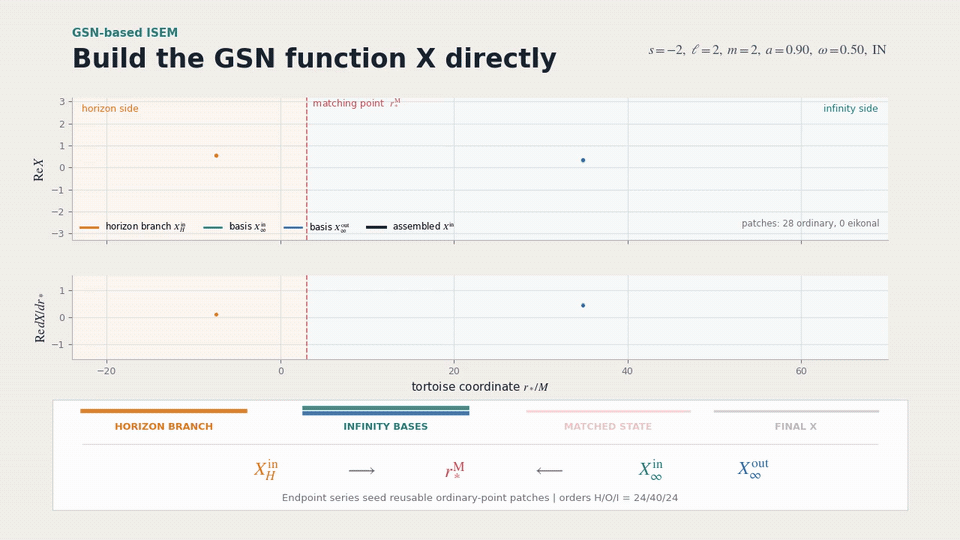

# GeneralizedSasakiNakamura.jl


[](https://github.com/ricokaloklo/GeneralizedSasakiNakamura.jl/releases)
[](http://ricokaloklo.github.io/GeneralizedSasakiNakamura.jl)

GeneralizedSasakiNakamura.jl solves the frequency-domain radial Teukolsky equation of a Kerr black hole with the Generalized Sasaki-Nakamura (GSN) formalism. It handles *both ingoing and outgoing* radiation of scalar, electromagnetic and gravitational type (spin weight $s = 0, \pm 1, \pm 2$), accepts *complex* frequencies, and uses the $M = 1$ convention throughout. Beyond the source-free (homogeneous) equation, it computes the waveform amplitudes and fluxes radiated by a test particle on a generic bound Kerr geodesic.

The angular Teukolsky equation is solved with the accompanying package [SpinWeightedSpheroidalHarmonics.jl](https://github.com/ricokaloklo/SpinWeightedSpheroidalHarmonics.jl) using a spectral decomposition method.

The paper describing both the GSN formalism and the implementation can be found in [2306.16469](https://arxiv.org/abs/2306.16469). A set of Mathematica notebooks deriving all the equations used in the code can be found in [10.5281/zenodo.8080241](https://zenodo.org/records/8080242).

**Contents**
- [What's new in v0.10.0](#whats-new-in-v0100)
- [Installation](#installation)
- [Homogeneous solvers](#homogeneous-solvers)
  - [Solver methods](#solver-methods)
  - [Basic radial-solution example](#basic-radial-solution-example)
  - [Complex frequencies, quasinormal modes, and excitation factors](#complex-frequencies-quasinormal-modes-and-excitation-factors)
- [Inhomogeneous solvers](#inhomogeneous-solvers)
  - [Point-particle sources and single-mode solutions](#point-particle-sources-and-single-mode-solutions)
  - [Total fluxes](#total-fluxes)
  - [Convolution quadrature and accuracy controls](#convolution-quadrature-and-accuracy-controls)
  - [Parallel execution and cache sharing](#parallel-execution-and-cache-sharing)
- [How to cite](#how-to-cite)
- [License](#license)

## What's new in v0.10.0

Version 0.10.0 adds a GSN-based solver that directly solves the generalized Sasaki–Nakamura equation using iterative series expansion matching (ISEM), along with a Kerr quasinormal-mode solver. To support large-scale parallel computations, the point-particle mode and flux solvers now support thread-safe concurrent calls on the default route, sharing synchronized caches within each submission.

For high-index tail modes in eccentric and generic flux summations, large radial indices n make the convolution integrands highly oscillatory. These integrals can now use adaptive Levin quadrature in the radial direction, combined with Clenshaw–Curtis quadrature in the polar direction for generic orbits, instead of trapezoidal quadrature. Method selection and refinement are handled automatically: users only need to specify the desired accuracy, and the solver adapts the computation to meet that target.

Earlier releases: v0.8.0 added waveform amplitudes and fluxes at infinity and at the horizon for a test particle on a _generic (eccentric, inclined) timelike bound orbit_, by solving the inhomogeneous SN equation using integration by parts; v0.9.0 added the ISEM solver (_iterative series expansion matching_) and the high-level total-flux interface `Teukolsky_pointparticle_flux`.

## Installation
Julia 1.12 or later in the 1.x series is required.

To install the package using the Julia package manager, simply type the following in the Julia REPL:
```julia
using Pkg
Pkg.add("GeneralizedSasakiNakamura")
```

*Note: There is no need to install [SpinWeightedSpheroidalHarmonics.jl](https://github.com/ricokaloklo/SpinWeightedSpheroidalHarmonics.jl) separately as it should be automatically installed by the package manager.*

Version 0.10 requires KerrGeodesics v0.5 and SpinWeightedSpheroidalHarmonics v1.4, both available from the General registry.

## Homogeneous solvers

These solvers construct source-free radial solutions with prescribed boundary conditions (`IN`: purely ingoing at the horizon; `UP`: purely outgoing at infinity), together with their asymptotic amplitudes. The same radial interfaces, `Teukolsky_radial`, `GSN_radial` and `Y_radial`, accept real and complex frequencies.

### Solver methods

The `method` keyword selects the solver. The default `method = "auto"` uses the direct GSN-based ISEM and falls back to the legacy automatic route only if direct construction fails.

#### Numerical integration (`method = "linear"` or `"Riccati"`)

The original GSN solver works at *both low and high frequencies* by numerically evolving the radial equation with the `linear` or `Riccati` method and attaching analytical boundary ansatzes near the horizon and infinity:

<p align="center">
  
</p>

The on-the-fly benchmark against the Mathematica MST implementation is shown below:

<table>
  <tr>
    <th>GeneralizedSasakiNakamura.jl numerical solver</th>
    <th><a href="https://github.com/BlackHolePerturbationToolkit/Teukolsky">Teukolsky</a> Mathematica package using the MST method </th>
  </tr>
  <tr>
    <td><p align="center"></p></td>
    <td><p align="center"></p></td>
  </tr>
</table>

*(There was no caching in this benchmark; the equation was solved on the fly. The notebook generating the speed animation can be found [here](https://github.com/ricokaloklo/GeneralizedSasakiNakamura.jl/blob/main/examples/realtime-demo.ipynb).)*

#### Legacy ISEM (`method = "ISEM"`)

The original, Teukolsky-based ISEM implementation remains available with the explicit `method = "ISEM"`. Its matching controls (`xm` as a negative matching coordinate, `rhom`, and the `TSinInf`, `TSoutInf`, `TSinHor`, `TSoutHor` identity switches) apply only to this method; an `xm` value cannot be transferred to `"GSN-ISEM"`, whose coordinates differ. See the [API reference](docs/src/APIs.md) for the keyword list.

#### Direct GSN-based ISEM (`method = "GSN-ISEM"`)

The direct solver constructs the GSN radial function $X$ from series expansions matched on the GSN equation itself; the Teukolsky function $R$ and the source-adapted function $Y$ are numerical transformations of that same solution:

<p align="center">
  
</p>

`method = "GSN-ISEM"` selects it strictly, with no fallback. The default `method = "auto"` first tries the same solver with automatic frequency, spin, representation and matching controls; if direct construction throws, it reports the failure and falls back to the legacy automatic radial route. The homogeneous radial Teukolsky/GSN equations are solved typically at millisecond timescale or faster, and this route is also used by the single-mode point-particle amplitudes and total-flux mode summations.

Superradiance-threshold solutions with $\omega = m a / (2 r_+)$ are handled by a dedicated horizon-threshold GSN-ISEM branch, while static/zero-frequency solutions are solved analytically with Gauss hypergeometric functions.

### Basic radial-solution example

The following snippet solves the (source-free) Teukolsky function for the mode $s=-2, \ell=2, m=2, a/M=0.7, M\omega=0.5$ with the purely-ingoing boundary condition at the horizon, $R^{\textrm{in}}$, and the purely-outgoing boundary condition at spatial infinity, $R^{\textrm{up}}$:
```julia
using GeneralizedSasakiNakamura # This is going to take some time to pre-compile, mostly due to DifferentialEquations.jl

# Specify which mode to solve
s=-2; l=2; m=2; a=0.7; omega=0.5;

# NOTE: julia uses 'just-ahead-of-time' compilation. Calling this the first time in each session will take some time
Rin, Rup = Teukolsky_radial(s, l, m, a, omega)
```
That's it! In the Julia REPL this returns

<details>
<summary>Output</summary>

```
(
TeukolskyRadialFunction(
    mode = Mode(s = -2, l = 2, m = 2, a = 0.7, omega = 0.5, lambda = 1.6966094016353415),
    boundary_condition = IN,
    transmission_amplitude = 1.0 + 0.0im,
    incidence_amplitude = 6.536587661184236 - 4.941203897065118im,
    reflection_amplitude = -0.1282466191290958 - 0.4404813349644446im,
    normalization_convention = UNIT_TEUKOLSKY_TRANS
),
TeukolskyRadialFunction(
    mode = Mode(s = -2, l = 2, m = 2, a = 0.7, omega = 0.5, lambda = 1.6966094016353415),
    boundary_condition = UP,
    transmission_amplitude = 1.0 + 0.0im,
    incidence_amplitude = -1.1698840333865992 - 2.5455723340434875im,
    reflection_amplitude = 2.5169908586317717 - 8.644964686261376im,
    normalization_convention = UNIT_TEUKOLSKY_TRANS
))
```

</details>

In the Julia REPL you can inspect all the asymptotic amplitudes at a glimpse using something like
```julia
julia> Rin
TeukolskyRadialFunction(
    mode = Mode(s = -2, l = 2, m = 2, a = 0.7, omega = 0.5, lambda = 1.6966094016353415),
    boundary_condition = IN,
    transmission_amplitude = 1.0 + 0.0im,
    incidence_amplitude = 6.536587661184236 - 4.941203897065118im,
    reflection_amplitude = -0.1282466191290958 - 0.4404813349644446im,
    normalization_convention = UNIT_TEUKOLSKY_TRANS
)
```

For example, if we want to evaluate the Teukolsky function $R^{\textrm{in}}$ at the location $r = 10M$, simply do
```julia
Rin(10)
```
This should give
```
77.57508416830544 - 429.4029095224015im
```

The GSN function and the source-adapted function are available in the same way through `GSN_radial` and `Y_radial`; see the [API reference](docs/src/APIs.md).

### Complex frequencies, quasinormal modes, and excitation factors

The radial interfaces accept complex frequencies directly. Finding a quasinormal-mode (QNM) frequency is a separate root search: `qnm` computes the root and then evaluates the corresponding GSN scattering data at it. For the $a=0.68$, $s=-2$, $(\ell,m,n)=(2,2,0)$ mode, the ordinary and mirror branches are

```julia
ordinary_mode = qnm(0.68, -2, 2, 2, 0)
mirror_mode = qnm(0.68, -2, 2, 2, 0, mirror)
```

<details>
<summary>Output</summary>

```text
QuasiNormalMode(
    parameters = (a = 0.68, s = -2, l = 2, m = 2, n = 0)
    omega = 0.52397510429008387 - 0.081512623631199529im
    lambda = 1.6550030612535804 + 0.36026776076186157im
    incidence_amplitude = -2.7105108183450338e-13 - 2.6237426978389081e-13im
    reflection_amplitude = -0.80073261705163268 + 0.029136276806015594im
    incidence_derivative = -2.1438079331183544 + 6.7875557754655729im
    excitation_factor = 0.019833940788207563 + 0.10427056859796389im
    formalism = GSN)

QuasiNormalMode(
    parameters = (a = 0.68, s = -2, l = 2, m = 2, n = 0)
    omega = -0.31116285768546026 - 0.088754663319965468im
    lambda = 5.4219094861401063 + 0.40958044727148396im
    incidence_amplitude = 1.0863202903062678e-16 + 1.9786037254804651e-14im
    reflection_amplitude = -1.2675830722584842 + 0.57434916613843456im
    incidence_derivative = 9.1832313898895048 - 11.99041112156098im
    excitation_factor = 0.13913753384431687 + 0.030226487428830294im
    formalism = GSN)
```

</details>

The computed frequency can be passed directly to the radial interfaces without truncating its digits:

```julia
Rin, Rup = Teukolsky_radial(-2, 2, 2, 0.68, ordinary_mode.omega)
```

```julia
julia> Rup
TeukolskyRadialFunction(
    mode = Mode(s = -2, l = 2, m = 2, a = 0.68, omega = 0.5239751042900839 - 0.08151262363119953im, lambda = 1.6550030612535804 + 0.36026776076186157im),
    boundary_condition = UP,
    transmission_amplitude = 1.0 + 0.0im,
    incidence_amplitude = 1.607773988395004e-15 - 1.0117545585358508e-15im,
    reflection_amplitude = 1.101161565720038 + 2.1300599921594596im,
    normalization_convention = UNIT_TEUKOLSKY_TRANS
)
```

For a QNM frequency $\omega_q$, the returned GSN excitation factor is

```math
\alpha^{{\rm GSN}}_{\ell m\omega_q}
=\left.\frac{\partial A^{{\rm GSN},{\rm inc}}_{\ell m\omega}}
{\partial\omega}\right|_{\omega=\omega_q},
\qquad
B^{{\rm GSN}}_{\ell m\omega_q}
=\frac{A^{{\rm GSN},{\rm ref}}_{\ell m\omega_q}}
{2\omega_q\alpha^{{\rm GSN}}_{\ell m\omega_q}}.
```

`ordinary` is the default branch. `mirror` computes the negative-real branch directly rather than filling its amplitudes by conjugation. Use `detailed=true` only when callable `X`, `Y`, and `R` solutions are needed.

Default overtone labels follow the Python [`qnm`](https://github.com/duetosymmetry/qnm) package (Stein 2019) and the Cook–Zalutskiy catalogue; near the algebraically special frequency, $n = 8$ is Cook's $8_0$. See the [QNM documentation](docs/src/QNM.md) for the labeling convention and for root-only and sequence interfaces.

## Inhomogeneous solvers

These solvers compute the radiation from a point particle on a bound Kerr geodesic: single-mode amplitudes and fluxes at infinity and at the horizon, and total fluxes summed over modes.

### Point-particle sources and single-mode solutions

A source is specified by the black-hole spin $a/M$ and the orbit's semi-latus rectum $p$, eccentricity $e$ and inclination parameter $x = \cos\theta_{\rm inc}$. A mode is labeled by $(s, \ell, m, n, k)$, where $n$ and $k$ are the radial and polar harmonic indices; $s = -2$ gives the solution at infinity and $s = +2$ the solution at the horizon.

#### Amplitudes at infinity

For the $s = -2$, $\ell = m = 2$ mode driven by a test particle on a bound geodesic with $a/M = 0.9, p = 6M, e = 0.7, x = \cos(\pi/4)$:
```julia
mode_info = Teukolsky_pointparticle_mode(-2, 2, 2, 0, 0, 0.9, 6, 0.7, cos(π/4))
```
where $n = 0$ and $k = 0$ label the radial and polar modes, respectively.
To have a glimpse of the output, one can do so with
```julia
julia> mode_info
TeukolskyPointParticleMode(
    mode = Mode(s = -2, l = 2, m = 2, n = 0, k = 0, a = 0.9, omega = 0.06568724726732753, lambda = 3.606789012119982),
    amplitude_inf = 0.00023429507956770147 - 6.558414441157039e-5im,
    energy_flux_inf = 1.0917330113048678e-6,
    angular_momentum_flux_inf = 3.324033375494758e-5,
    Carter_const_flux_inf = 5.890504443058213e-5,
    method = (method = "isem_trapezoidal", radial_method = "GSN-ISEM", radial_sfe = false, N = 256, K = 64, truncation_floor = 1.0e-16),
)
```
To access for example the amplitude at infinity,
```julia
julia> mode_info.amplitude
0.00023429507956770147 - 6.558414441157039e-5im
```
which is the value for $Z^{\infty}_{\ell m n k}$, the amplitude of the inhomogeneous radial Teukolsky solution near infinity for that particular frequency.

#### Amplitudes at the horizon

For the same parameters, change the sign of $s$ to $2$:
```julia
mode_info = Teukolsky_pointparticle_mode(2, 2, 2, 0, 0, 0.9, 6, 0.7, cos(π/4))
```
The output should be
```julia
julia> mode_info
TeukolskyPointParticleMode(
    mode = Mode(s = 2, l = 2, m = 2, n = 0, k = 0, a = 0.9, omega = 0.06568724726732753, lambda = -0.39321098788001757),
    amplitude_hor = 0.006089946888790686 - 0.001413001966508359im,
    energy_flux_hor = -2.8438148784298695e-9,
    angular_momentum_flux_hor = -8.658651402627332e-8,
    Carter_const_flux_hor = -1.534395681285149e-7,
    method = (method = "isem_trapezoidal", radial_method = "GSN-ISEM", radial_sfe = false, N = 256, K = 64, truncation_floor = 1.0e-16),
)
```
To access for example the amplitude at the horizon,
```julia
julia> mode_info.amplitude
0.006089946888790686 - 0.001413001966508359im
```
which is the value for $Z^{\mathrm{H}}_{\ell m n k}$, the amplitude of the inhomogeneous radial Teukolsky solution near the horizon for that particular frequency.

### Total fluxes

`Teukolsky_pointparticle_flux` sums the mode fluxes and automatically dispatches to circular, eccentric, inclined, or generic mode summation according to the orbital parameters. A generic-orbit run can be substantially slower than an eccentric equatorial run because it performs two-dimensional convolution integrals. The run times below are those of these examples on the machine that produced them, not general performance guarantees.

<details>
<summary>Circular equatorial orbit</summary>

```julia
julia> flux = Teukolsky_pointparticle_flux(0.9, 6.0, 0.0, 1.0; tol=1e-8)
TeukolskyPointParticleFlux(
    orbital_parameters(a = 0.9, p = 6.0, e = 0.0, x = 1.0),
    orbit_type = circular,
    infinity_energy_flux = 0.0005658659548571375,
    infinity_angular_momentum_flux = 0.008825776472648025,
    infinity_carter_constant_flux = 0.0,
    horizon_energy_flux = -4.177363290666302e-6,
    horizon_angular_momentum_flux = -6.515407815579624e-5,
    horizon_carter_constant_flux = 0.0,
    total_modes = 378,
    l_reached = (infinity = 19, horizon = 12),
    convolution_integral = (strategy = "no convolution integral is needed",),
    tolerance = 1.0e-8,
    truncation_floor = (infinity = 1.0e-16, horizon = 1.0e-16),
    cost = 0.6770381927490234 seconds,
)
```

With `e = 0` and `x = 1` the call dispatches to the circular equatorial summation, which needs no convolution integral. In this example the warm run averaged about `1.79 ms` per computed mode.

</details>

<details>
<summary>Spherical (inclined circular) orbit</summary>

```julia
julia> flux = Teukolsky_pointparticle_flux(0.9, 6.0, 0.0, 0.5; tol=1e-8)
TeukolskyPointParticleFlux(
    orbital_parameters(a = 0.9, p = 6.0, e = 0.0, x = 0.5),
    orbit_type = inclined,
    infinity_energy_flux = 0.0006637621566020543,
    infinity_angular_momentum_flux = 0.0060183149433979885,
    infinity_carter_constant_flux = 0.04294455189603736,
    horizon_energy_flux = -3.0865749224058106e-6,
    horizon_angular_momentum_flux = -0.00010495330048599927,
    horizon_carter_constant_flux = 8.871154473182051e-5,
    total_modes = 11466,
    k_reached_inf = 15,
    k_reached_hor = 13,
    convolution_integral = (strategy = "ISEM adaptive trapezoidal for all modes",),
    tolerance = 1.0e-8,
    truncation_floor = (infinity = 1.0e-16, horizon = 1.0e-16),
    cost = 7.612027883529663 seconds,
)
```

With `e = 0` and `|x| < 1` the call dispatches to the inclined (spherical-orbit) summation. In this example the warm run averaged about `0.66 ms` per computed mode.

</details>

<details>
<summary>Eccentric equatorial orbit</summary>

```julia
julia> flux = Teukolsky_pointparticle_flux(0.9, 6.0, 0.7, 1.0; tol=1e-8)
TeukolskyPointParticleFlux(
    orbital_parameters(a = 0.9, p = 6.0, e = 0.7, x = 1.0),
    orbit_type = eccentric,
    infinity_energy_flux = 0.0007457787885708406,
    infinity_angular_momentum_flux = 0.0067595177009140235,
    infinity_carter_constant_flux = 0.0,
    horizon_energy_flux = -8.777498432552521e-6,
    horizon_angular_momentum_flux = -7.361786661019822e-5,
    horizon_carter_constant_flux = 0.0,
    total_modes = 45204,
    n_reached = (infinity = 124, horizon = 58),
    convolution_integral = (strategy = "ISEM adaptive trapezoidal for all computed n; tail ISEM adaptive Levin enabled but not triggered", tail_levin_nmin = 50, tail_levin_local_n = 16, tail_levin_max_depth = 8),
    tolerance = 1.0e-8,
    truncation_floor = (infinity = 1.0e-16, horizon = 1.0e-16),
    cost = 44.061431884765625 seconds,
)
```

This warm high-eccentricity equatorial run averaged about `0.97 ms` per computed mode.

</details>

<details>
<summary>Generic orbit</summary>

```julia
julia> flux = Teukolsky_pointparticle_flux(0.9, 6.0, 0.7, 0.5; tol=1e-8)
TeukolskyPointParticleFlux(
    orbital_parameters(a = 0.9, p = 6.0, e = 0.7, x = 0.5),
    orbit_type = generic,
    infinity_energy_flux = 0.001146554871827448,
    infinity_angular_momentum_flux = 0.006379470773907821,
    infinity_carter_constant_flux = 0.04144388278184294,
    horizon_energy_flux = -9.201266282186275e-6,
    horizon_angular_momentum_flux = -0.00036271559365667997,
    horizon_carter_constant_flux = 0.0009653100803714303,
    total_modes = 443900,
    n_reached = (infinity = 134, horizon = 72),
    convolution_integral = (strategy = "ISEM adaptive trapezoidal for all computed n; tail ISEM adaptive Levin enabled but not triggered", tail_levin_nmin = 50, tail_levin_local_n = 16, tail_levin_max_depth = 8),
    tolerance = 1.0e-8,
    truncation_floor = (infinity = 1.0e-16, horizon = 1.0e-16),
    cost = 1627.6419110298157 seconds,
)
```

This high-eccentricity generic run averaged about `3.667 ms` per computed mode.

</details>

### Convolution quadrature and accuracy controls

Each mode amplitude is a convolution integral of the radial solution over the orbit. At large radial index $n$ the integrand oscillates rapidly, so uniform trapezoidal sampling needs dense grids. For modes with large $n$, eccentric and generic summations can instead use adaptive Levin quadrature in the radial direction, which bisects the radial interval until the mode amplitude converges or a depth limit is reached; generic two-dimensional convolutions pair it with a fixed Clenshaw–Curtis rule in the polar direction. This choice concerns the convolution quadrature only; the radial solutions themselves come from the solver methods above.

The switch is automatic (`tail_levin`, by default automatic). Users set the target accuracy with `tol`: single modes refine their grids until the mode converges to that target, up to the grid caps `Nmax` and `Kmax`, and the summation stops adding shells once they fall below the target. These are convergence controls, not strict global error bounds for every parameter. See the [API reference](docs/src/APIs.md) for the keywords.

### Parallel execution and cache sharing

For large-scale parallel computations, point-particle mode and flux calls are thread-safe on the default route. Calls on one orbit can share a read-only trajectory and sampling geometry through a submission (`with_pointparticle_submission`), while every mode keeps its own private workspace; caches are not shared across orbits, and admitted work is drained before a submission releases its caches. See [Parallel Calls](docs/src/APIs.md#parallel-calls) and [Point-particle submissions](docs/src/APIs.md#point-particle-submissions) for usage and the verified scope.

## How to cite
If you have used this code in your research that leads to a publication, please cite the following article:
```
@article{Lo:2023fvv,
    author = "Lo, Rico K. L.",
    title = "{Recipes for computing radiation from a Kerr black hole using a generalized Sasaki-Nakamura formalism: Homogeneous solutions}",
    eprint = "2306.16469",
    archivePrefix = "arXiv",
    primaryClass = "gr-qc",
    doi = "10.1103/PhysRevD.110.124070",
    journal = "Phys. Rev. D",
    volume = "110",
    number = "12",
    pages = "124070",
    year = "2024"
}
```

Additionally, if you have used this code's capability to solve for solutions with complex frequencies, please also cite the following article:
```
@article{Lo:2025njp,
    author = "Lo, Rico K. L. and Sabani, Leart and Cardoso, Vitor",
    title = "{Quasinormal modes and excitation factors of Kerr black holes}",
    eprint = "2504.00084",
    archivePrefix = "arXiv",
    primaryClass = "gr-qc",
    doi = "10.1103/PhysRevD.111.124002",
    journal = "Phys. Rev. D",
    volume = "111",
    number = "12",
    pages = "124002",
    year = "2025"
}
```

If you have used this code's capability to solve for the gravitational waveform amplitudes and fluxes at infinity and at horizon with a test particle orbiting a Kerr black hole in a generic timelike bound and stable orbit (e.g., for extreme mass ratio inspiral waveforms), please cite the following articles:
```
@article{Yin:2025kls,
    author = "Yin, Yucheng and Lo, Rico K. L. and Chen, Xian",
    title = "{Gravitational radiation from Kerr black holes using the Sasaki-Nakamura formalism: waveforms and fluxes at infinity}",
    eprint = "2511.08673",
    archivePrefix = "arXiv",
    primaryClass = "gr-qc",
    doi = "10.1103/9ngz-k1lr",
    journal = "Phys. Rev. D",
    volume = "113",
    pages = "124007",
    year = "2026"
}

@article{Lo:2025lpo,
    author = "Lo, Rico K. L. and Yin, Yucheng",
    title = "{Near-horizon gravitational perturbations of rotating black holes}",
    eprint = "2512.07937",
    archivePrefix = "arXiv",
    primaryClass = "gr-qc",
    doi = "10.1103/bljh-l413",
    journal = "Phys. Rev. D",
    volume = "113",
    number = "6",
    pages = "L061505",
    year = "2026"
}
```


## License
The package is licensed under the MIT License.
